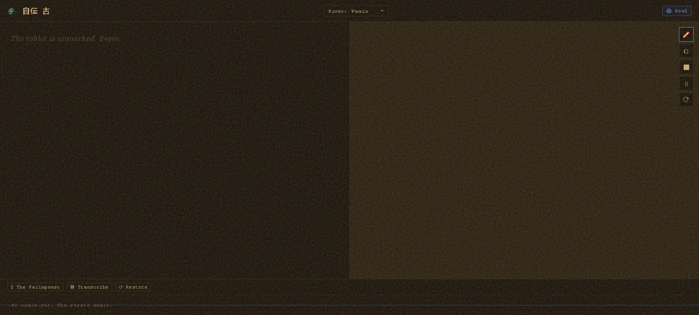

# 自伝 古 — Jiden Furui

> *"Ancient things have edges."*

A local-first, single-file journaling tool with built-in version control. Write. Draw. Seal. The file remembers everything.

---

## What It Is

Jiden Furui is a `.html` file that is also its own database, its own version control system, and its own archive.

There is no server. No account. No cloud. No installation.

You open the file. You write and draw. When you are ready, you **Seal** — the app downloads a new copy of itself with your changes and your entire history baked inside. You keep that file. You work from that file. The document carries its own past.

---

## How It Works
Open file → Write & Draw → Seal → New file downloads → Open new file → repeat
Every sealed version contains:
- Your current text and drawing
- Every previous version, back to the first
- The full branch history
- Everything needed to run the app

Sharing a version means sending a file.

---

## Features

- **Text Tablet** — Freeform rich text editor with bold and italic support
- **Drawing Stone** — Freehand canvas with five pigments and three stroke widths. High-DPI aware.
- **Seals** — Version snapshots. Every seal is a point you can return to.
- **Strata** — Visual timeline of your seals along the bottom of the screen. Click any node to navigate history.
- **Rivers** — Branch your work. Maintain parallel versions of the same document.
- **Confluence** — Merge any river's text and strokes into your current river. Records the merge as a distinct seal in the timeline.
- **Palimpsest** — Word-level diff view. Compare any two seals side by side. Additions appear in teal, deletions in red strikethrough. Older canvas ghosted beneath the new.
- **Transcribe** — Export the full lineage of the current river as a plaintext file with timestamps.
- **Resurrect** — Navigate to any historical seal and branch forward from it.
- **Burden Indicator** — Warns when the artifact file is growing large.

---

## Usage

1. Download `jiden-furui.html`
2. Open it in any modern browser
3. Write something. Draw something.
4. Click **⊕ Seal** (or `Ctrl+S`)
5. Keep the downloaded file. That is your new working copy.
6. Repeat.

To branch: open the river selector and create a new river. Your current HEAD becomes its starting point.

To merge: open the river selector and click ⋈ Confluence next to any other river.

To compare: click **⧖ The Palimpsest** in the footer and select two seals.

---

## Design Constraints

These are features, not limitations:

- **One file.** The entire application, all history, all branches — one `.html` file.
- **No dependencies.** No frameworks, no CDN, no internet required after download.
- **No server.** Your writing never leaves your machine unless you choose to send the file.
- **Backward compatible.** Old sealed files will always open in new versions of the app.

---

## Aesthetic

Jiden Furui uses the visual language of ancient record-keeping. The interface borrows from clay tablets, cuneiform archives, archaeological strata, and the physical act of inscription.

| Interface concept | Name |
|---|---|
| Version snapshot | Seal |
| Branch | River |
| Merge | Confluence |
| Diff view | Palimpsest |
| Version timeline | Strata |
| Restore old version | Resurrect |
| Export to plaintext | Transcribe |
| Version history | Lineage |
| Text editor | Text Tablet |
| Drawing area | Drawing Stone |

---

## Philosophy

Most writing tools put your work in someone else's system. Jiden Furui puts it in a file. A file you can copy, archive, email, print, encrypt, or bury.

The version history is not a feature bolted on. It is the structure of the document itself. Every sealed artifact is complete and self-contained. If you lose every version except one, that one version still contains everything it knew at the moment it was sealed.

This is how clay tablets work. It is a good model.

---

## Browser Support

Any modern browser. No installation. Works offline.

---

## License

Do what you want with it. If you make something good, send it to someone.

---

*自伝 古 — Jiden Furui — Ancient Autobiography*
